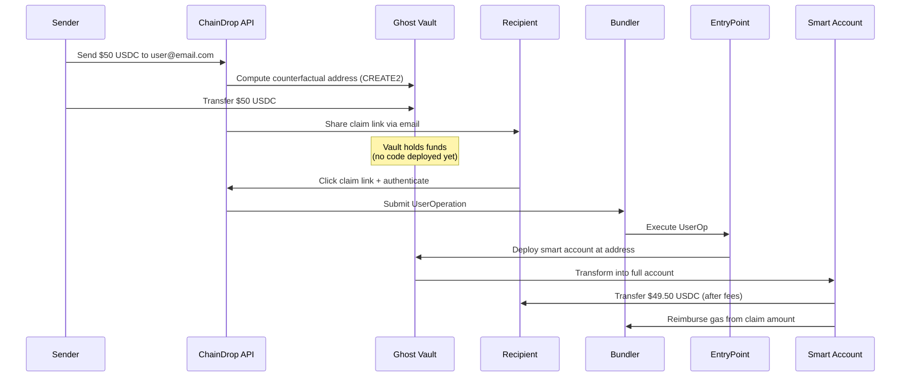

# ChainDrop

<div align="center">

### Reverse Onboarding for Blockchain Value Delivery

**Send crypto to anyone, anywhere — no wallet required**

[](https://opensource.org/licenses/MIT)
[](https://soliditylang.org/)
[](https://eips.ethereum.org/EIPS/eip-4337)
[](https://cronos.org)

[Overview](#overview) • [How It Works](#how-it-works) • [Architecture](#architecture) • [Quick Start](#quick-start) • [Documentation](#documentation)

---

### Cronos x402 Hackathon Submission

**Category:** Agentic Finance

**Key Integrations:**
- Anthropic Claude API - Natural language payment parsing
- Crypto.com AI Agent SDK - Blockchain operations
- Cronos EVM Testnet - Smart contract deployment
- ERC-4337 Account Abstraction - Gasless transactions

</div>

## Overview

ChainDrop is a **gasless payment protocol** built on Ethereum Account Abstraction (ERC-4337) that enables users to send digital assets using **email addresses, phone numbers, or social handles** — without requiring recipients to create a wallet, manage seed phrases, or pre-fund gas fees.

### The Problem

Blockchain systems enforce a rigid, identity-first lifecycle:

1. User creates a wallet
2. User secures private keys
3. User acquires native gas tokens
4. User receives value
5. User interacts with applications

This creates severe friction. Studies show **onboarding drop-off rates exceed 80%**, limiting blockchain adoption to technically sophisticated users.

### The Solution: Reverse Onboarding

ChainDrop inverts the traditional lifecycle to a **value-first model**:

```
Traditional:  Account → Identity → Value
ChainDrop:    Value → Account → Identity
```

Recipients receive funds **before** creating a wallet. Wallet creation happens automatically when they claim, with transaction costs deducted directly from the transferred amount.

---

## Key Features

### For Recipients
- **Zero Setup Required** — Receive crypto without creating a wallet first
- **100% Gasless** — No need to acquire CRO or understand gas fees
- **Social Identifiers** — Claim using email, phone, or Twitter instead of 0x addresses
- **Instant Onboarding** — Embedded wallet created automatically with Privy
- **Non-Custodial** — Full ownership from the moment of claim
- **Email Notifications** — Get notified instantly when someone sends you crypto

### For Senders
- **Familiar UX** — Send to `user@email.com` instead of `0x742d35Cc...`
- **Multi-Asset Support** — Send CRO or any ERC-20 token (USDC, USDT, etc.)
- **Self-Funded Transactions** — No ongoing platform subsidies required
- **One-Click Sharing** — Generate claim links automatically shared via email
- **Transfer Tracking** — Monitor pending and claimed transfers easily
- **AI Payment Agents** — Create autonomous agents that send payments based on triggers

### Technical Innovation
- **Ghost Vaults** — Counterfactual addresses that receive funds before deployment
- **CREATE2 Determinism** — Pre-computed addresses using EIP-1014
- **Atomic Reimbursement** — Self-funding deployment without external subsidies
- **ERC-4337 Compliant** — Full Account Abstraction compatibility
- **Modular Identity** — Pluggable verifiers for privacy and flexibility
- **AI Payment Automation** — Claude-powered agents for scheduled and conditional payments

---

## ✨ Featured Capabilities

### 1. **Social Identity Payments**
Send crypto using email addresses, phone numbers, or Twitter handles. Recipients don't need a wallet — it's created automatically when they claim.

### 2. **Email Notifications** 📧
Recipients receive beautiful HTML email notifications when someone sends them crypto, with:
- Instant notification when transfer is sent
- One-click claim link
- Confirmation email after successful claim
- Transaction details and explorer links

### 3. **AI Payment Agents** 🤖
Create autonomous payment agents powered by Claude that can:
- Schedule recurring payments (daily, weekly, monthly)
- Trigger payments based on conditions (e.g., "Pay $100 to alice@example.com every Monday")
- Automate payroll, subscriptions, and rewards
- Execute complex payment logic without manual intervention

### 4. **Embedded Wallets via Privy**
- Social login (Email, Twitter, Phone)
- Automatic wallet creation
- No seed phrases to manage
- Export to MetaMask/other wallets
- Fully non-custodial

### 5. **Beautiful Modern UI**
- Gradient design with Cronos brand colors
- Responsive mobile-first layout
- Smooth animations and transitions
- Real-time balance updates
- Transaction history and pending claims

---

## How It Works

### The Flow



### Step-by-Step

1. **Sender Initiates Transfer**
   - Enters recipient identifier (e.g., `alice@example.com`)
   - Specifies amount and token (e.g., 50 USDC)
   - ChainDrop computes deterministic address using CREATE2
   - Funds sent to "Ghost Vault" (address with no deployed code)

2. **Recipient Receives Notification**
   - Gets claim link via email/SMS
   - No wallet or blockchain knowledge required
   - Link contains secure claim token

3. **Recipient Claims**
   - Authenticates using email/social account
   - ChainDrop generates claim proof
   - UserOperation submitted to ERC-4337 bundler

4. **Atomic Deployment & Reimbursement**
   - Smart account deployed at Ghost Vault address
   - Funds transfer to recipient's control
   - Gas costs reimbursed from claim amount
   - All steps execute atomically (success or full revert)

5. **Result**
   - Recipient has a fully-featured smart account
   - Funds available immediately
   - Zero gas spent by recipient
   - Self-sustaining economics (no ongoing subsidies)

---

## Architecture

### Core Components

#### Smart Contracts (`/contracts/contracts/core/`)

| Contract | Purpose | Key Features |
|----------|---------|--------------|
| **AccountFactory.sol** | Creates deterministic smart accounts | Uses CREATE2 for counterfactual addressing<br/>Generates salts from hashed identifiers<br/>Deploys ERC-1967 proxy contracts |
| **SimpleAccount.sol** | ERC-4337 compliant smart account | Receives funds before deployment<br/>Implements secure claim verification<br/>Prevents double-claiming<br/>Supports session keys & social recovery |
| **ChainDropPaymaster.sol** | Sponsors gas for claim transactions | Validates UserOperations<br/>Charges configurable fee (0.5-1%)<br/>Reimburses bundlers atomically |
| **ClaimVerifier.sol** | Cryptographic claim validation | Generates verifiable proofs<br/>Hashes identifiers for privacy<br/>ECDSA signature recovery |

#### Backend API (`/backend/src/`)

```
├── controllers/
│   ├── transferController.js    # HTTP request handlers for transfers
│   ├── agentController.js       # HTTP request handlers for API agents
│   └── aiController.js          # AI chat and natural language parsing
├── services/
│   ├── transferService.js       # Business logic (create, claim, verify)
│   ├── blockchainService.js     # Smart contract interactions
│   ├── emailService.js          # Email notifications via Resend
│   ├── agentService.js          # API agent management and execution
│   ├── aiService.js             # Claude API integration for NLP
│   └── cryptoComAgentService.js # Crypto.com AI Agent SDK integration
├── db/
│   └── schema.js                # SQLite schema (transfers, claims, agents)
└── routes/
    └── index.js                 # API route definitions
```

#### Frontend App (`/frontend/src/`)

```
├── pages/
│   ├── HomePage.jsx             # Landing page with feature showcase
│   ├── SendPage.jsx             # Send crypto interface
│   ├── ClaimPage.jsx            # Claim funds page
│   ├── WalletPage.jsx           # Wallet dashboard
│   └── AgentsPage.jsx           # AI agent management + AI chat
├── components/
│   ├── Navigation.jsx           # Reusable navigation bar
│   └── AIChat.jsx               # AI payment assistant chat interface
└── index.css                    # Tailwind configuration & custom styles
```

### Technical Stack

**Blockchain**
- Solidity 0.8.28 with Cancun EVM optimizations
- Hardhat development framework
- OpenZeppelin Contracts v5.4.0
- Account Abstraction (ERC-4337) v0.8.0
- Cronos Testnet (Chain ID: 338)

**Backend**
- Node.js + Express.js v5.2.1
- SQLite + Drizzle ORM v0.45.1 (PostgreSQL ready for production)
- ethers.js v6.16.0 for blockchain interaction
- Resend for email notifications
- Anthropic Claude API for natural language payment parsing
- Crypto.com AI Agent SDK for blockchain operations

**Frontend**
- React 19 + Vite 7
- Privy for embedded wallet authentication
- TailwindCSS v4 with custom Cronos theme
- React Router v7 for navigation
- Beautiful gradient UI with responsive design
- AI chat interface for natural language payments

---

## Ghost Vaults: The Core Innovation

A **Ghost Vault** is a counterfactual smart account that:

1. **Exists before deployment** — Address computed deterministically via CREATE2
2. **Receives funds trustlessly** — Ethereum state allows balances at non-deployed addresses
3. **Claimable exactly once** — Cryptographic proofs prevent unauthorized access
4. **Transforms atomically** — Becomes a full smart account upon claim

### Deterministic Address Generation

```solidity
// Pseudocode
salt = keccak256(abi.encodePacked(
    hashedIdentifier,  // e.g., keccak256("user@email.com")
    nonce,             // Prevents collisions
    chainId            // Chain-specific
))

ghostVaultAddress = CREATE2(
    factoryAddress,
    salt,
    keccak256(accountInitCode)
)
```

This enables:
- **Push payments** — Send funds before recipient setup
- **Predictable addresses** — Same identifier always produces same address
- **No coordination** — Sender and recipient never interact directly

---

## API Documentation

### Base URL
```
https://api.chaindrop.app  (Production - TBD)
http://localhost:3000      (Local Development)
```

### Endpoints

#### 1. Create Transfer

Send funds to an identifier.

```http
POST /api/transfer/send
Content-Type: application/json

{
  "senderAddress": "0x742d35Cc6634C0532925a3b844Bc9e7595f0bEb",
  "recipientIdentifier": "alice@example.com",
  "amount": "50",
  "token": "USDC"
}
```

**Response:**
```json
{
  "success": true,
  "data": {
    "claimToken": "eyJhbGc...",
    "claimLink": "https://chaindrop.app/claim/eyJhbGc...",
    "ghostVaultAddress": "0x9f8b7c6d5e4a3b2c1d0e9f8a7b6c5d4e3f2a1b0c",
    "expiresAt": "2026-01-07T08:00:00Z",
    "estimatedGas": "0.15 USDC"
  }
}
```

#### 2. Claim Transfer

Claim funds from a Ghost Vault.

```http
POST /api/transfer/claim
Content-Type: application/json

{
  "claimToken": "eyJhbGc...",
  "recipientWalletAddress": "0x1234567890abcdef...",
  "claimProof": "0xsignature..."
}
```

**Response:**
```json
{
  "success": true,
  "data": {
    "transactionHash": "0xabc123...",
    "deployedAccountAddress": "0x9f8b7c6d...",
    "claimedAmount": "49.50",
    "gasCostDeducted": "0.50",
    "token": "USDC"
  }
}
```

#### 3. Estimate Transfer

Get Ghost Vault address and gas estimate before sending.

```http
POST /api/transfer/estimate

{
  "recipientIdentifier": "alice@example.com",
  "amount": "50",
  "token": "USDC"
}
```

#### 4. Get Transfer Details

```http
GET /api/transfer/:claimToken
```

#### 5. List Sender Transfers

```http
GET /api/transfer/sender/:senderAddress
```

#### 6. Platform Statistics

```http
GET /api/transfer/stats
```

**Response:**
```json
{
  "totalTransfers": 1247,
  "totalClaimed": 892,
  "totalVolumeUSD": "125000.50",
  "activeGhostVaults": 355,
  "averageClaimTimeHours": 2.3
}
```

---

## Quick Start

### Prerequisites

- Node.js v18+
- npm or yarn
- Cronos Testnet CRO ([Faucet](https://cronos.org/faucet))
- Resend API key for email notifications ([Get one here](https://resend.com/api-keys))

### Installation

```bash
# Clone repository
git clone https://github.com/Jeremicarose/ChainDrop.git
cd ChainDrop

# Install contract dependencies
cd contracts
npm install

# Install backend dependencies
cd ../backend
npm install
```

### Smart Contract Deployment

```bash
cd contracts

# Configure environment
cp .env.example .env
# Edit .env with your Cronos Testnet RPC URL and deployer private key

# Compile contracts
npx hardhat compile

# Run tests
npx hardhat test

# Deploy to Cronos Testnet
npx hardhat run scripts/deploy.js --network cronosTestnet

# Verify contracts (optional)
npx hardhat verify --network cronosTestnet <CONTRACT_ADDRESS>
```

### Backend Setup

```bash
cd backend

# Configure environment
cp .env.example .env
# Add:
# - Deployed contract addresses
# - Admin private key
# - Resend API key (get from https://resend.com/api-keys)
# - Database connection string

# Initialize database
npm run db:push

# Start development server
npm run dev

# Production
npm start
```

Server runs at `http://localhost:3000`

### Frontend Setup

```bash
cd frontend

# Install dependencies
npm install

# Configure environment
cp .env.example .env
# Add your Privy App ID

# Start development server
npm run dev
```

Frontend runs at `http://localhost:5173`

### Testing the Flow

```bash
# 1. Send a test transfer
curl -X POST http://localhost:3000/api/transfer/send \
  -H "Content-Type: application/json" \
  -d '{
    "senderAddress": "0xYourAddress",
    "recipientIdentifier": "test@example.com",
    "amount": "10",
    "token": "ETH"
  }'

# 2. Get claim link from response and test claim
curl -X POST http://localhost:3000/api/transfer/claim \
  -H "Content-Type: application/json" \
  -d '{
    "claimToken": "<TOKEN_FROM_STEP_1>",
    "recipientWalletAddress": "0xRecipientAddress"
  }'
```

---

## Use Cases

### Remittances
Send USDC internationally using just a phone number. Recipients claim funds without understanding blockchain, with fees far lower than Western Union or PayPal.

### Payroll & Gig Payments
DAOs and companies pay contributors via email addresses. No need to collect wallet addresses or manage onboarding.

### Airdrops
Protocols distribute tokens to real identifiers (email/Twitter), reducing bot farming and increasing claim rates from ~5% to ~60%+.

### Consumer Applications
Apps deliver immediate value to new signups, funding their first wallet automatically. Users experience value before infrastructure.

### Cross-Border B2B Payments
Businesses pay international vendors using familiar identifiers, avoiding SWIFT delays and high fees.

---

## Security Model

### Claim Authorization

- **Cryptographic Proofs**: Only authenticated owner of identifier can generate valid claim proof
- **One-Time Claims**: Salts and nonces prevent replay attacks
- **Atomic Execution**: Deployment + claim + reimbursement succeed together or revert entirely
- **Self-Funded Claims**: Gas costs deducted from transferred amount automatically

### Address Security

- **No Squatting**: Salts include unpredictable elements (sender nonce + timestamp)
- **Factory Enforcement**: Only valid claims trigger deployment
- **Deterministic Safety**: CREATE2 guarantees address consistency

### Relayer Protection

- **Gas Limits**: Strict caps prevent DoS attacks
- **Rate Limiting**: Per-identifier claim frequency restrictions
- **Decentralized Bundlers**: Integration with Pimlico and other bundler networks

### Privacy

- **Hashed Identifiers**: On-chain storage uses `keccak256(identifier)`, not plaintext
- **Off-Chain Verification**: Identity providers never hold funds or keys
- **Future ZK Integration**: Zero-knowledge proofs for enhanced privacy (roadmap)

### Audits

Smart contracts designed for third-party security audits. Production deployment will undergo formal verification by OpenZeppelin or similar firms.

---

## Economic Model

### Self-Sustaining Design

ChainDrop does **not** rely on ongoing gas subsidies. Each transfer is economically self-contained:

1. Sender deposits funds to Ghost Vault
2. Recipient claims → gas deducted from claim amount
3. Platform fee (0.5-1%) covers operational costs
4. No external funding required after initial deployment

### Fee Structure

| Transfer Type | Fee | Who Pays |
|---------------|-----|----------|
| Individual transfers | 0.5-1% | Deducted from claim amount |
| Enterprise (SaaS) | Flat monthly fee | Sender organization |
| Airdrops (bulk) | Volume-discounted | Protocol/sender |

### Comparison with Alternatives

| Solution | Ongoing Subsidies? | Sustainable? | Recipient Cost |
|----------|-------------------|--------------|----------------|
| Traditional Paymasters | Yes (perpetual) | No | Zero (subsidized) |
| Embedded Wallets | Yes (per-tx) | No | Gas fees required |
| **ChainDrop** | **No (one-time)** | **Yes** | **Zero (self-funded)** |

---

## Roadmap

### Phase 1: MVP ✅ (Completed)
- [x] Core smart contracts (AccountFactory, SimpleAccount, Paymaster, ClaimVerifier)
- [x] Backend API with PostgreSQL database
- [x] Ghost Vault implementation
- [x] ERC-4337 integration
- [x] Cronos Testnet deployment
- [x] Frontend web application with React + Vite
- [x] Email notification system via Resend
- [x] Privy embedded wallet integration
- [x] Beautiful Tailwind CSS UI with gradient design
- [x] AI Payment Agents powered by Claude API

### Phase 2: Production Launch (Q1 2026)
- [ ] SMS notification system
- [ ] Additional identity verifiers (Worldcoin, OAuth providers)
- [ ] Security audit by reputable firm
- [ ] Cronos Mainnet deployment
- [ ] Initial partnerships (remittance providers, DAOs)

### Phase 3: Scale (Q2 2026)
- [ ] Mobile apps (iOS/Android)
- [ ] Batch transfer support
- [ ] Cross-chain bridging (Optimism, Arbitrum, Polygon)
- [ ] Advanced analytics dashboard
- [ ] Decentralized bundler network

### Phase 4: Ecosystem Expansion (Q3-Q4 2026)
- [ ] Developer SDK & API
- [ ] E-commerce platform plugins (Shopify, WooCommerce)
- [ ] Embeddable widget for websites
- [ ] Zero-knowledge proof verifiers
- [ ] Governance token launch
- [ ] DAO transition

---

## Comparison with Existing Solutions

| Feature | Traditional Wallets | Embedded Wallets | Gas-Sponsored Wallets | **ChainDrop** |
|---------|-------------------|------------------|----------------------|---------------|
| Wallet required first | Yes | Yes | Yes | **No** |
| Seed phrase management | Required | Optional | Optional | **Not needed** |
| Pre-fund gas | Yes | No | No | **No** |
| Send to social identifier | No | Limited | Limited | **Yes** |
| Self-sustaining economics | N/A | No (subsidies) | No (subsidies) | **Yes** |
| Value-before-account | No | No | No | **Yes** |
| AI-powered payments | No | No | No | **Yes** |

---

## Contributing

We welcome contributions from the community!

### Development Setup

```bash
# Fork and clone the repository
git clone https://github.com/<YOUR_USERNAME>/ChainDrop.git
cd ChainDrop

# Create feature branch
git checkout -b feature/your-feature-name

# Make changes and test
npm test

# Commit with conventional commits
git commit -m "feat: add new claim verification method"

# Push and open PR
git push origin feature/your-feature-name
```

### Contribution Guidelines

- Follow Solidity style guide for smart contracts
- Use ESLint/Prettier for JavaScript
- Write tests for new features (aim for >80% coverage)
- Update documentation for API changes
- Open issues before major refactors

---

## License

This project is licensed under the **MIT License** - see [LICENSE](LICENSE) file for details.

---

## Deployed Contracts

### Cronos Testnet (Chain ID: 338)

| Contract | Address | Explorer |
|----------|---------|----------|
| EntryPoint | `0x216e29695D99cEfE8009B7486AD99aC0f5DA2ddd` | [View](https://explorer.cronos.org/testnet/address/0x216e29695D99cEfE8009B7486AD99aC0f5DA2ddd) |
| AccountFactory | `0xD1F80bcFe28F36a66aFcc6eBd0BDD522cD25158C` | [View](https://explorer.cronos.org/testnet/address/0xD1F80bcFe28F36a66aFcc6eBd0BDD522cD25158C) |
| ChainDropPaymaster | `0x4C6d079F051CfcFB48f32C858E937e51Bb17095c` | [View](https://explorer.cronos.org/testnet/address/0x4C6d079F051CfcFB48f32C858E937e51Bb17095c) |
| ClaimVerifier | `0xC40A98006023B7A74e789e3EFc9E82f191eCB619` | [View](https://explorer.cronos.org/testnet/address/0xC40A98006023B7A74e789e3EFc9E82f191eCB619) |

**RPC URL:** `https://evm-t3.cronos.org`
**Explorer:** `https://explorer.cronos.org/testnet`

---

## Resources

### Documentation
- [Litepaper](./LITEPAPER.md) - Non-technical overview
- [Getting Started](./docs/GETTING_STARTED.md) - Quick start guide
- [API Reference](./docs/API.md) - Complete API documentation
- [Smart Contract Docs](./docs/CONTRACTS.md) - Contract architecture
- [System Architecture](./docs/ARCHITECTURE.md) - Technical deep dive

### Links
- **Website**: [Coming Soon]
- **Blog**: [Coming Soon]
- **Twitter**: [@ChainDrop](https://twitter.com/ChainDrop) *(placeholder)*
- **Discord**: [Join Community](https://discord.gg/chaindrop) *(placeholder)*
- **Documentation**: [docs.chaindrop.app](https://docs.chaindrop.app) *(placeholder)*

### References
- [EIP-1014: CREATE2](https://eips.ethereum.org/EIPS/eip-1014)
- [ERC-4337: Account Abstraction](https://eips.ethereum.org/EIPS/eip-4337)
- [Cronos Developer Docs](https://docs.cronos.org)
- [OpenZeppelin Contracts](https://docs.openzeppelin.com/contracts/)
- [Safe Protocol](https://docs.safe.global/)
- [Privy Documentation](https://docs.privy.io)
- [Resend API](https://resend.com/docs)

---

## Acknowledgments

ChainDrop builds on foundational work by:

- **Ethereum Foundation** — ERC-4337 Account Abstraction standard
- **OpenZeppelin** — Secure smart contract libraries
- **Cronos** — EVM-compatible blockchain infrastructure
- **Crypto.com** — Cronos ecosystem support
- **Safe** — Smart account reference implementation
- **Privy** — Embedded wallet and authentication
- **Resend** — Modern email API
- **Anthropic** — Claude AI for payment automation

---

## Disclaimer

⚠️ **ChainDrop is currently in testnet/MVP phase.**

- Do not use with real funds on mainnet until full security audit
- Smart contracts have not been formally verified
- API may change without notice during development
- Use at your own risk

This software is provided "as is" without warranty of any kind, express or implied.

---

<div align="center">

**Making crypto payments as simple as sending an email**

Built with ❤️ for the future of accessible blockchain

[⭐ Star us on GitHub](https://github.com/Jeremicarose/ChainDrop) • [🐛 Report Bug](https://github.com/Jeremicarose/ChainDrop/issues) • [💡 Request Feature](https://github.com/Jeremicarose/ChainDrop/issues)

</div>
